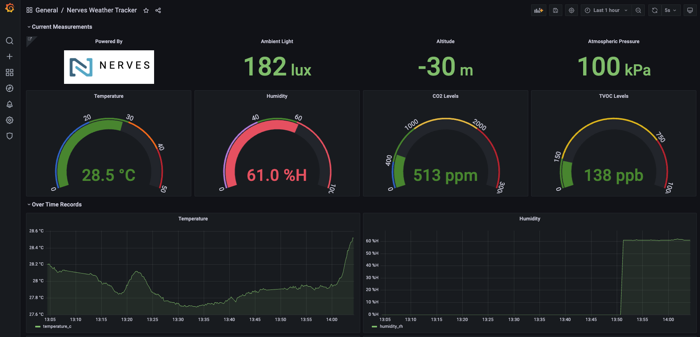
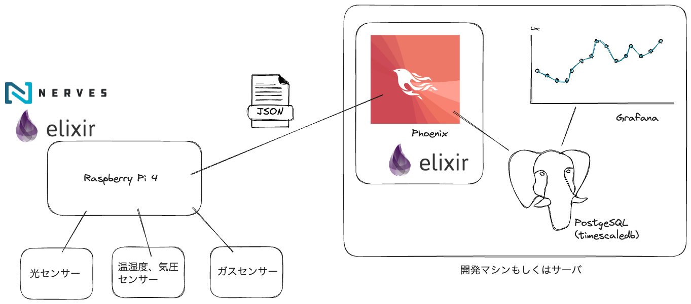
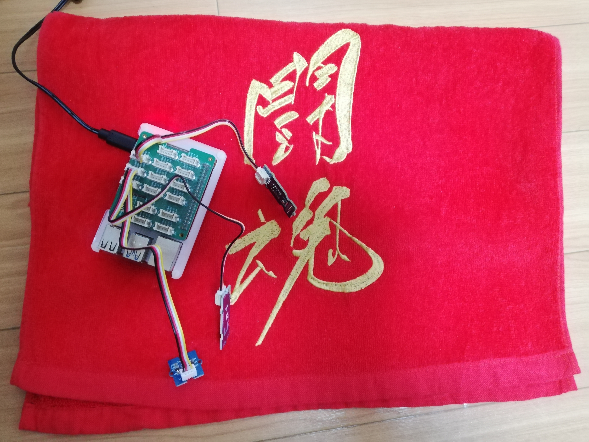

# はじめに

このリポジトリは書籍『[Build a Weather Station with Elixir and Nerves](https://pragprog.com/titles/passweather/build-a-weather-station-with-elixir-and-nerves/)』を参考に、IoTデバイス向けのソフトウェア、サーバーサイドのソフトウェアを両方とも[Elixir](https://elixir-lang.org/)で開発したものです。

This repository is based on the book "Build a Weather Station with Elixir and Nerves" and developed both software for IoT devices and server-side software with Elixir.








# 必要なもの(ハードウェア)

| No | 名前 | おおよその値段(2023/06/30現在) |
| --- | --- | --- |
| 1 | [Raspberry Pi 4 Model B / 4GB](https://www.switch-science.com/products/5680) | ¥11,000 |
| 2 | [GROVE ベースHAT for Raspberry Pi](https://www.switch-science.com/products/5336)  | ¥1,800  |
|3 | [GROVE - I2C デジタル光センサ](https://www.switch-science.com/products/1174) | ¥1,800 |
| 4 | [GROVE - 温湿度・気圧センサ（BME280）](https://www.switch-science.com/products/3374) | ¥1,800 |
| 5 |[GROVE - VOC/eCO2 ガスセンサ, SGP 30](https://www.switch-science.com/products/8533)  | ¥1,800 |
| 6 |[ラズパイ 4 の場合は USB Type C の電源](https://www.switch-science.com/products/5683)  | ¥2,000 |
| 7 | 4GB程度のmicroSDカード  | ¥1,000 |

# 必要なもの(ソフトウェア)

- [Elixir](https://elixir-lang.org/) v1.14.4
- [Nerves Installation](https://hexdocs.pm/nerves/installation.html)
- [Docker](https://www.docker.com/)

# 環境変数の設定

- `NERVES_NETWORK_SSID`
- `NERVES_NETWORK_PSK`
- `WEATHER_TRACKER_SERVER_IP_ADDRESS` (ホストマシンのIPアドレス)

# 動かし方

動かし方を説明します。  
Raspberry Pi 4とホストマシン(開発マシン)が同じWi-Fiのネットワークにいることが前提です。

## ファームウェアの作成

microSDカードに焼き込むファームウェアを作成します。

```bash
git clone https://github.com/autoracex/sensor_hub_poncho.git
cd sensor_hub
export MIX_TARGET=rpi4
mix firmware
```

## ファームウェアの焼き込み

microSDカードをホストマシンに差し込んで次のコマンドで焼き込みをします。

```bash
mix burn
```

こんがり焼きあがったらRaspberry Pi 4に差し込んで、電源ONしてください。

## サーバーサイド

```bash
cd weather_tracker
docker-compose up
mix setup
mix phx.server
```

Visit: http://localhost:3000

username, passwordの初期値はともに`admin`です。  
左端のメニュー「+」で「Import」を選び、`weather_tracker/NervesWeatherTracker.json`を選択してインポートします。  
そうすると以下のようなど派手なダッシュボードが表示されます。


# 参考にしたリポジトリ

お手本です。ありがとうーーーッ　でございます！！！

https://github.com/NervesJP/sensor_hub_poncho